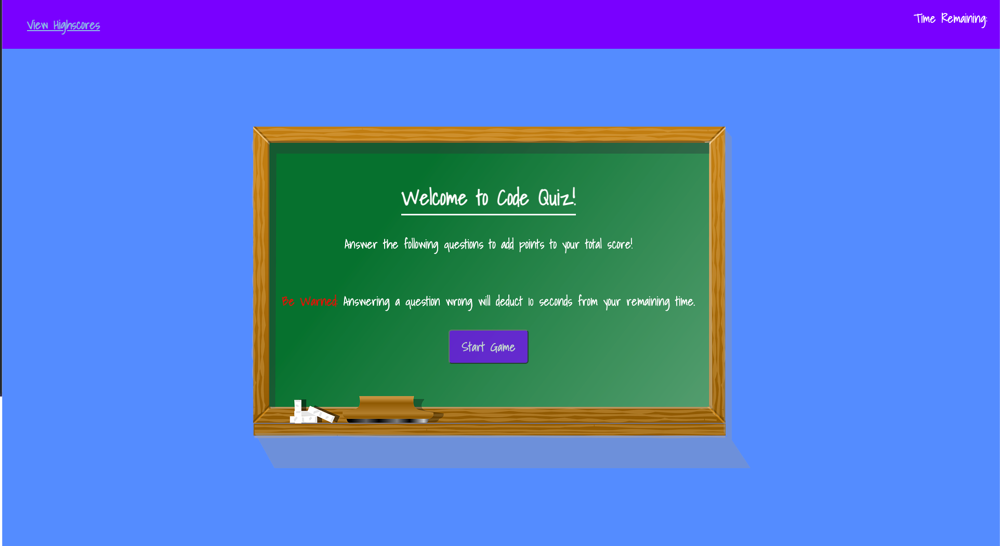

### Live Deployed Link
- https://bdejene19.github.io/CodeQuiz/

# Code Trivia to Test Your Knowledge!

## Deployed Screenshot

## About 
This application is a quiz based on coding topics. During the quiz, you have 90 seconds to solve 5 questions. Answering questions correctly adds 100 points to your score, while incorrect answers will result in a 10 second deduction from your time left. UI updates to allow users to differentiate right from wrong answers more easily. Finishing the quiz with more time is a bonus, since total score also includes a time bonus for how quickly the quiz was solved. At the end of the quiz, usernames and scores can be saved into local storage to compare and contrast your quiz score versus others.

